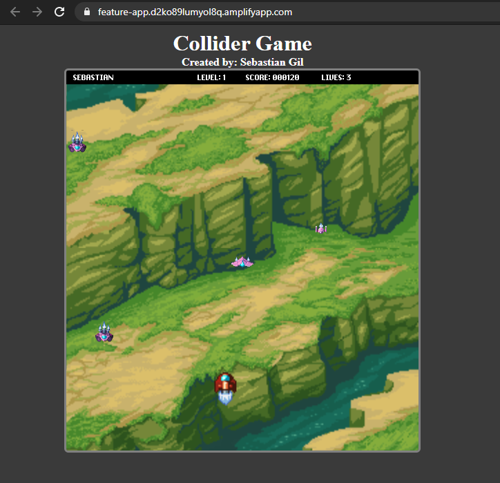

# Collider - Phaser Game

This is a 2D endless running game created using ES6 and the game engine Phaser 3. The objective of the game is to collide against other ships to accumulate points.

The difficulty is increased according to the level of the player.

## Design Process

Since I had no prior experience working with Phaser, the design process started by checking the possibilities with this game engine.
Some of the resources used during this phase were the following:

- [Getting started tutorial](http://phaser.io/tutorials/making-your-first-phaser-3-game/part1)
- [Create a videogame template](https://phasertutorials.com/creating-a-phaser-3-template-part-1/)

Once it was cleared what was possible, it was time to define what the objective of the game was, how the elements of the game were going to interact with each other, the difficulty level and how it would change as the player progresses through the game. Here are the resources used to aid in this part of the process:

- [Beginner’s Guide to Game Mechanics](https://www.gamedesigning.org/learn/basic-game-mechanics/)
- [The 3 Primary Principles of Game Design](https://www.gamedesigning.org/learn/game-design-principles/)
- [The Ultimate Guide to Level Design](https://www.gamedesigning.org/learn/level-design/)

By the end of the design process the following items were defined:

- Assets (audios and visuals) needed.
- Gameplay and game mechanics.
- Levels and difficulty.
- Interaction between the player and the game elements (enemies/ships).
- Scoring system.

## Live Game

[Visit Live Here](https://feature-app.d2ko89lumyol8q.amplifyapp.com/)

## Video Preview

[View video](https://www.loom.com/share/9ac8d6874a7b4bcbb4bfccb4801e16f3)

## Screenshot

## Features & Usage

- The player can enter their name to save their score and see if they made it to the leaderboard.
- An options page allows the user to disable the background music.
- When "Play" is clicked the user can see instructions to play and enter their name.
- If the player collides with a ship, the ship explodes, the score increases, and a sound effect is played.
- If the player misses to collide with a ship the lives count decreases and a sound effect is played to signal this.
- When all lives are used and a ship is missed, the game is over and the Leaderboard comes up, where the user can see if they made the cut, and see other players' scores.
- The level and difficulty increase every 500 points earned.
- The player can move their ship using the arrow keys.

## Potential Features

- Change scenery for every level.
- Make it scalable for small screens.
- Add touch support to move the player's ship to play o mobile.

## Setup

1. Clone this repository and access the project's directory.
2. Run "npm install".
3. Run "npm run start" to work on the development server.
4. Run "npm run build" once the project is ready for production.

## Tests

Run "npm test".

## Built With

- JavaScript/ES6
- NPM + Webpack
- Phaser 3
- Axios
- AWS Amplify

## Author

👤 **Sebastian Gil Rodriguez**

- Github: [@sebGilR](https://github.com/sebGilR)
- Twitter: [@sebGilR](https://twitter.com/sebGilR)
- Linkedin: [sebastiangilrodriguez](https://www.linkedin.com/in/sebastiangilrodriguez)

## 🤝 Contributing

Contributions, issues and feature requests are welcome!

Feel free to check the [issues page](issues/).

## Show your support

Give a ⭐️ if you like this project!

## Acknowledgement

- Pixel art and sound effects by [Pixel Art Game](http://pixelgameart.org/web/)
